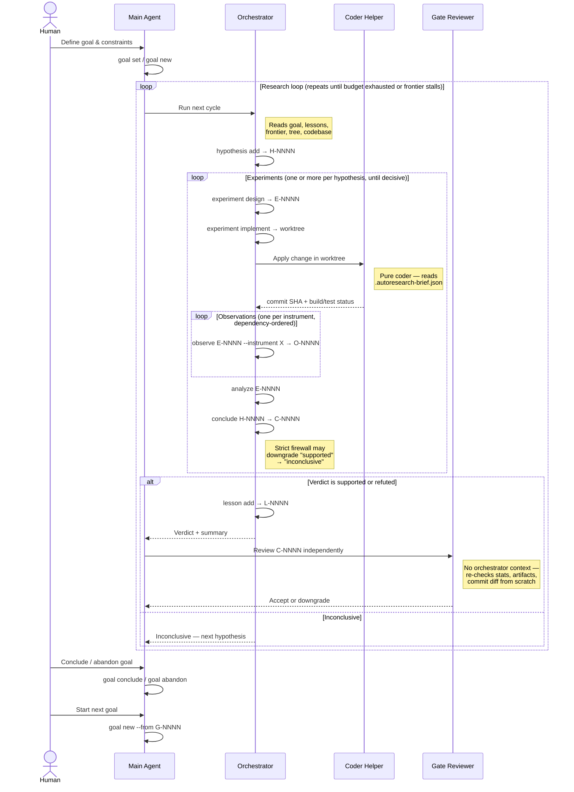

# autoresearch

> Autonomous, agentic research over an existing codebase.

`autoresearch` turns [Claude Code](https://claude.com/claude-code) or Codex
into a disciplined scientific researcher operating on a working codebase. It
generates falsifiable hypotheses, runs instrument-backed experiments in
isolated git worktrees, and draws statistically-sound conclusions — with a
strict firewall between speculation and observation.

It is for **optimizing existing, working systems against measurable goals**.
It is **not** a feature-delivery or program-synthesis tool. If your goal cannot
be expressed as a number an instrument can measure, autoresearch is the wrong
tool.

The human's interface is the main agent session; `.research/` is the
durable substrate. You steer by talking to the agent, not by editing state
files or typing into a dashboard.

## What it does

You define a goal: an objective metric (with a direction and target effect)
plus a set of constraints (other instruments that must pass or stay within
bounds). Claude Code or Codex, driven by two embedded agent contracts, then
loops:



Every experiment runs in its own git worktree against the same baseline. Every
observation is content-addressed and logged. Every conclusion goes through a
strict-mode firewall — if the bootstrap CI crosses zero in the wrong direction,
or the effect is smaller than the hypothesis predicted, "supported" is
automatically downgraded to "inconclusive."

The CLI is the only writer of state. Subagents only ever invoke `autoresearch`
verbs; they never edit `.research/` directly.

## Install

```sh
make install      # go install ./cmd/autoresearch → $GOPATH/bin/autoresearch
make build        # local ./autoresearch (gitignored)
make test         # go vet + go test ./...
```

Requires Go 1.26+.

## Quickstart

Human setup is a short, one-time CLI step. After that, the main Claude Code
or Codex session is the orchestrator: it should invoke mutating
`autoresearch` verbs on the human's behalf while the human watches the
dashboard or event log.

```sh
cd path/to/your/project
autoresearch init --build-cmd "make all" --test-cmd "make test"
autoresearch instrument register host_timing \
    --cmd "./build/main" --parser builtin:timing --unit s --min-samples 30
autoresearch instrument register size_flash \
    --cmd "size ./build/main" --parser builtin:size --unit bytes
autoresearch goal set --file goal.md
autoresearch dashboard --refresh 2
```

`autoresearch init` installs both agent integrations automatically. From that
point on, stop typing mutating `autoresearch` verbs yourself. Open Claude Code
or Codex in the same project and tell the main agent to run the loop for you.

For example:

```text
Read the local autoresearch docs for this project. Use autoresearch as the
only writer of research state, and start the research loop for the current
goal. I will observe via the dashboard.
```

Claude reads `.claude/autoresearch.md` plus the `.claude/agents/research-*.md`
prompts. Codex reads the managed `AGENTS.md` block,
`.codex/autoresearch.md`, and the `.codex/agents/research-*.md` role briefs.

### Worked example: FIR filter optimization

[`examples/cortex-m4-synth/`](examples/cortex-m4-synth) is a ready-to-run
project: a naive direct-form FIR filter (`src/dsp_fir.c`) with host-timing
and fake-qemu instruments, a 20% reduction goal, and a 20-experiment budget.

```sh
# Copy it out of the repo so autoresearch can use its own git worktrees
cp -r examples/cortex-m4-synth /tmp/my-fir
cd /tmp/my-fir

# Bootstrap: creates git repo, inits .research/, registers instruments, and sets an initial goal
./bootstrap.sh

# Terminal 1 — watch the dashboard (interactive read-only TUI)
autoresearch dashboard tui

# Terminal 2 — open Claude Code/Codex in the same directory and say:
```

```text
Read the local autoresearch docs for this project. Use autoresearch as
the only writer of research state, and start the research loop for the
current goal. I will observe via the dashboard.
```

The agent reads `.claude/autoresearch.md` and the two prompts under
`.claude/agents/`, then drives the loop autonomously: proposing hypotheses,
designing experiments, implementing changes in isolated worktrees, running
instruments (with dependency ordering — `host_test` must pass before
`host_timing` runs), and concluding with the strict-mode firewall. The
gate reviewer is dispatched automatically for decisive verdicts.

For a more hands-on first step:

```text
Start by proposing 2 falsifiable hypotheses for the current goal and
record them through autoresearch. Then recommend which one to pursue first.
```

## Command map

All commands accept `--json` (machine-readable output), `-C/--project-dir`
(target project), and `--dry-run`. Read-only verbs work even when the project
is paused.

| Group | Verbs |
| --- | --- |
| **lifecycle** | `init`, `status`, `pause`, `resume` |
| **goal** | `goal set`, `goal new`, `goal show`, `goal list`, `goal conclude`, `goal abandon` |
| **steering** | `steering show`, `steering append`, `steering edit` |
| **hypothesis** | `add`, `list`, `show`, `promote`, `kill`, `reopen` |
| **experiment** | `design`, `implement`, `reset`, `worktree`, `list`, `show`, `promote` |
| **observe** | `observe <exp> --instrument <name>` |
| **analyze** | `analyze <exp> [--baseline <exp>]` |
| **conclude** | `conclude <hyp> --verdict ... --observations ...` |
| **conclusion** | `list`, `show`, `downgrade` (gate-reviewer-only) |
| **tree / frontier** | `tree [--goal G-NNNN]`, `frontier [--goal G-NNNN]` |
| **log** | `log [--tail --kind --since --follow]` |
| **report** | `report <hyp>` |
| **artifact** | `list`, `stat`, `path`, `head`, `tail`, `range`, `grep`, `diff`, `show` |
| **instrument** | `list`, `register`, `run` |
| **budget** | `show`, `set` |
| **gc** | `gc` |
| **install** | `install claude [docs\|agents]`, `install codex [docs\|agents]` |
| **dashboard** | `dashboard [--refresh N] [--color auto\|always\|never]`, `dashboard tui` |

Exit codes: `0` success, `1` generic error, `2` cobra usage, `3` paused,
`4` budget exhausted. The orchestrator loop uses 3/4 to decide when to stop.

## Goal lifecycle

Goals are serialized: at most one is active at a time. `goal set` bootstraps
the first goal; `goal new` starts subsequent ones after the active goal is
concluded or abandoned. Closed goals are terminal — revisiting a problem space
after the code has evolved means creating a new goal via `goal new --from
G-NNNN`, which records the provenance link. Every hypothesis created while a
goal is active is bound to it via `goal_id`.

```sh
autoresearch goal set   --objective-instrument host_timing --objective-direction decrease \
                        --constraint-max 'size_flash=131072' --constraint-require 'host_test=pass'
autoresearch goal conclude --summary "demonstrated 18% gain"
autoresearch goal new   --from G-0001 --trigger C-0012 \
                        --objective-instrument host_timing --objective-direction decrease \
                        --constraint-max 'size_flash=131072'
```

## Goal format

Goals are markdown with YAML frontmatter, stored as `.research/goals/G-NNNN.md`:

```yaml
---
schema_version: 2
id: G-0001
status: active
created_at: 2026-04-12T10:00:00Z
objective:
  instrument: host_timing
  target: dsp_fir
  direction: decrease
  target_effect: 0.20
constraints:
  - instrument: size_flash
    max: 131072
  - instrument: host_test
    require: pass
---

# Steering

Free-form notes the agent uses to guide hypothesis generation.
Hard rules go here too.
```

## Instruments

An instrument is a shell command plus a parser. Four parsers ship built-in:

| Parser | Behaviour |
| --- | --- |
| `builtin:passfail` | Run once; value = 1 if exit 0 else 0. |
| `builtin:timing`   | Run N times; mean seconds + BCa 95% bootstrap CI. |
| `builtin:size`     | Run once; first numeric column from `size`-style output. |
| `builtin:scalar`   | Run N times; extract integer via regex; per-sample + BCa CI. |

Instruments may declare dependencies via `--requires` (e.g.
`--requires host_test=pass`). The firewall enforces these at observe time: an
instrument whose dependency has not been observed with a passing result on the
same experiment is refused. Use `observe --force` to bypass.

## Statistics

Single-sample summaries use BCa bootstrap 95% CIs (gonum, seeded for
reproducibility). Comparison against a baseline uses a percentile bootstrap on
the fractional delta plus a two-tailed Mann–Whitney U p-value. Default 2000
resamples. Strict-mode `conclude` downgrades a "supported" verdict whenever
the CI crosses zero in the wrong direction or the observed effect is smaller
than the hypothesis's declared `min_effect`.

## State layout

`autoresearch init` creates a `.research/` directory at the project root
(gitignored). Everything is plain files:

```
.research/
  config.yaml          # build/test cmds, instruments, budgets
  state.json           # pause flag, counters, current_goal_id, started_at
  events.jsonl         # append-only event log
  goals/G-NNNN.md      # objective + constraints + steering + lifecycle status
  hypotheses/H-NNNN.md # each bound to a goal via goal_id
  experiments/E-NNNN.md
  observations/O-NNNN.md
  conclusions/C-NNNN.md
  lessons/L-NNNN.md
  artifacts/<sha256>/…
```

The store walks upward from the working directory the way git does for
`.git/`, so any subcommand run from inside the project finds it. Worktrees
default to the user cache dir keyed by project hash; override
`worktrees.root` in `config.yaml` to put them on a fast SSD.

## Watching the loop

The dashboard is read-only by design: a window onto the research state, never
a steering surface. Leave it running in a second tmux pane or terminal while
you drive research from the main session.

```sh
autoresearch dashboard                  # one-shot composite snapshot
autoresearch dashboard tui              # interactive read-only TUI
autoresearch dashboard --refresh 2      # live, auto-redraws every 2s (TTY only)
autoresearch dashboard --json           # structured snapshot for tools
autoresearch log --follow               # tail events.jsonl as they arrive
```

`--refresh` requires a TTY and is rejected together with `--json` (use an
external polling loop if you want streaming JSON). `log --follow` polls
`events.jsonl` every 200 ms — no fsnotify dep, works the same over SSH.
Both verbs work while the project is paused.

### `dashboard tui`

A Bubble Tea TUI built on top of the same `captureDashboard` snapshot.
Richer than the one-shot view, but the read-only constraint is
identical: it never mutates `.research/`, and there are no "quick
action" keystrokes — steering is still conversational with the main
agent session.

The TUI surfaces every read-only CLI verb as a navigable view:

- **Dashboard** (home): responsive 2-column layout with hypothesis
  tree, frontier, in-flight experiments, and recent events. Tab to
  cycle focus, Enter to drill into the selected row (hypothesis,
  experiment, conclusion, or event) in the right column.
- **Hypothesis / Experiment / Conclusion** list + detail with filter
  cycling (`f`) and per-instrument summary stats via
  `stats.Summarize`.
- **Event log**: full log with follow mode, kind filter, and an event
  detail view that pretty-prints JSON payloads with colorized keys,
  strings, numbers, and literals.
- **Tree / Frontier / Goal / Status / Instruments**: full-screen
  versions of the corresponding CLI verbs.
- **Artifacts**: list + scrollable viewer with head/tail/full/grep
  modes. `d` prompts for a second SHA and shows the unified diff,
  colorized.
- **Report**: `buildReport` markdown rendered by `glamour` with a
  width-keyed cache for resize handling.

Top-level jump keys reach every view from anywhere:

```
H hypotheses      E experiments     C conclusions     L event log
T tree            F frontier        G goal            S status
A artifacts       I instruments     R report picker   D dashboard
? help overlay    Esc / ⌫  pop current view           q / Ctrl-C  quit
```

Jumps canonicalize the view stack, so pressing `H` twice does not grow
the breadcrumb — the second press is a no-op, and jumping to a view
from deeper in the stack truncates back to it instead of pushing a
duplicate.

## Status

The full research loop is operational: serialized multi-goal lifecycle,
hypothesis → experiment → observe → analyze → conclude with strict-mode
firewall, instrument dependencies, budgets, content-addressed artifacts,
cumulative lesson layer, live dashboard + Bubble Tea TUI, and a two-agent
model (orchestrator + independent gate reviewer).

## License

TBD.
