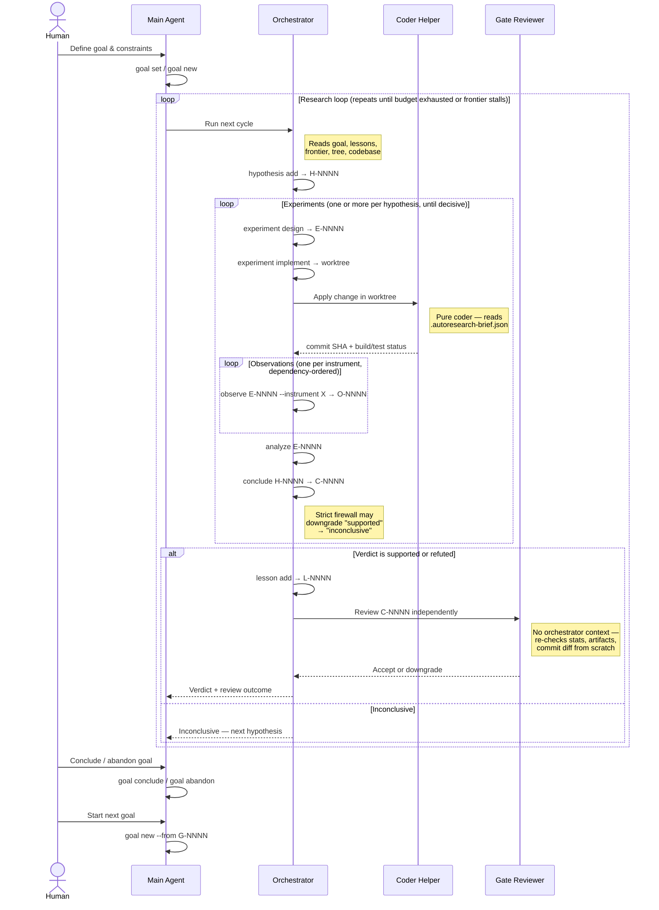

# autoresearch

> Autonomous, agentic research over an existing codebase.

`autoresearch` turns [Claude Code](https://claude.com/claude-code) or Codex
into a disciplined scientific researcher operating on a working codebase. It
generates falsifiable hypotheses, runs instrument-backed experiments in
isolated git worktrees, and draws statistically-sound conclusions — with a
strict firewall between speculation and observation.

It is for **optimizing existing, working systems against measurable goals**.
It is **not** a feature-delivery or program-synthesis tool. If your goal cannot
be expressed as a number an instrument can measure, autoresearch is the wrong
tool.

The human's interface is the main agent session; `.research/` is the
durable substrate. You steer by talking to the agent, not by editing state
files or typing into a dashboard.

## What it does

You define a goal: an objective metric, a set of constraints, and optionally
a success threshold plus continuation policy. Claude Code or Codex, driven by
two embedded agent contracts, then loops:



Every experiment runs in its own git worktree against the same baseline. Every
observation is content-addressed and logged. Every conclusion goes through a
strict-mode firewall — if the bootstrap CI crosses zero in the wrong direction,
or the effect is smaller than the hypothesis predicted, "supported" is
automatically downgraded to "inconclusive."

The CLI is the only writer of state. Subagents only ever invoke `autoresearch`
verbs; they never edit `.research/` directly.

Research also assumes the target project's main checkout stays stable while the
loop is running. Experiment and harness changes belong in experiment
worktrees. Setup refreshes under `AGENTS.md`, `.claude/`, `.codex/`,
`.gitignore`, or `.research/` are separate maintenance, not experiment output.
`autoresearch status` and `dashboard` warn via `main_checkout_dirty` /
`main_checkout_dirty_paths` when the main checkout drifts, so agents can stop
and surface explicit maintenance instead of quietly patching bootstrap files in
place.

## Core concepts

`autoresearch` deliberately separates intent, change, evidence, and judgment.
The core nouns are:

| Concept | What it is | Why it exists |
| --- | --- | --- |
| **Goal** | The optimization contract: objective instrument + direction, constraints, optional success threshold, and steering notes. | Defines what "better" means and scopes the research loop. |
| **Hypothesis** | A falsifiable claim that a concrete kind of change will move a named instrument in a named direction, optionally by at least `min_effect`. | Forces speculation to be explicit before code changes or verdicts happen. |
| **Experiment** | One concrete implementation attempt for a hypothesis, executed in its own git worktree. | Separates "what we changed" from "what we learned" and makes attempts reproducible. |
| **Baseline** | A special experiment representing the reference code for a goal. | Gives every later comparison a stable "better than what?" anchor. |
| **Observation** | The recorded result of running one instrument on one experiment: value, samples, CI, pass/fail, command, artifacts, and metadata. | This is the evidence layer. Conclusions may cite observations, not anecdotes. |
| **Conclusion** | A verdict over a hypothesis, derived from observations and compared against the goal baseline. | Records whether the evidence actually supports, refutes, or fails to decide the claim. |
| **Lesson** | A reusable takeaway extracted from prior work, either tied to a hypothesis chain or scoped to the system as a whole. | Prevents later cycles from rediscovering the same dead ends or overestimating future gains. |
| **Frontier** | A derived view of the best supported conclusions for the current goal, annotated for current loop actionability. | Shows whether the search is still improving or has stalled without hiding historically important wins. |
| **Instrument** | A command plus parser that turns program behavior into a number or pass/fail result. | Makes optimization targets measurable and repeatable. |
| **Artifact** | Content-addressed captured output attached to an observation. | Preserves the exact evidence a reviewer or human needs to audit a measurement. |

Some artifacts are evidence side-artifacts: analysis outputs captured
alongside a measurement so later mechanism claims are auditable from
persisted state.

`analyze` is a read-only computation over observations, not a first-class stored
entity. It summarizes an experiment relative to the baseline and prepares the
material a later `conclude` step will judge.

## Gates and firewalls

The system is intentionally gated at a few hard boundaries:

| Gate | Applied at | Why |
| --- | --- | --- |
| **Goal gate** | Only one goal may be active; new hypotheses bind to it; read surfaces default to that goal unless `--goal all` is used. | Keeps independent optimization efforts from contaminating each other. |
| **Experiment isolation** | Every experiment runs in its own git worktree from the recorded baseline. | Prevents cross-experiment leakage and makes resets cheap. |
| **Observation dependency gate** | `observe` refuses an instrument whose declared prerequisites (for example `host_test=pass`) have not passed on the same experiment, unless `--force` is used. | Stops invalid preconditions from being mistaken for meaningful measurements. |
| **Strict conclusion gate** | `conclude` may downgrade `supported` to `inconclusive` when the CI crosses zero in the wrong direction or the observed effect misses the hypothesis's `min_effect`. | Makes "supported" hard to earn. |
| **Independent review gate** | Decisive conclusions can be independently accepted or downgraded by the gate reviewer or `conclusion downgrade`. | Adds a second pass over stats, artifacts, and diffs before a result is treated as settled. |
| **Pause and budget gates** | Mutating verbs refuse to proceed when the project is paused or budgets are exhausted. | Gives humans and policies a hard stop on the loop. |
| **Single-writer gate** | Only the CLI writes `.research/`. Agents and subagents must go through verbs, not file edits. | Keeps state atomic, auditable, and machine-readable. |

## Install

```sh
make install      # go install ./cmd/autoresearch → $GOPATH/bin/autoresearch
make build        # local ./autoresearch (gitignored)
make test         # go vet + go test ./...
```

Requires Go 1.26+.

## Quickstart

Human setup is a short, one-time CLI step. After that, the main Claude Code
or Codex session is the orchestrator: it should invoke mutating
`autoresearch` verbs on the human's behalf while the human watches the
dashboard or event log.

```sh
cd path/to/your/project
autoresearch init --build-cmd "make all" --test-cmd "make test" --trust-shell
autoresearch instrument register host_timing \
    --cmd "./build/main" --parser builtin:timing --unit s --min-samples 30
autoresearch instrument register size_flash \
    --cmd "size ./build/main" --parser builtin:size --unit bytes
autoresearch goal set --file goal.md
autoresearch dashboard tui
```

`--trust-shell` adds `Bash(*)` to `.claude/settings.json` so subagents can run
shell commands (make, gcc, git, etc.) in experiment worktrees without prompts.
Omit it for a tighter permission model where each shell command is approved
individually. You can add it later with `autoresearch install claude --trust-shell`.

`autoresearch init` installs both agent integrations automatically. From that
point on, stop typing mutating `autoresearch` verbs yourself. Open Claude Code
or Codex in the same project and tell the main agent to run the loop for you.

For example:

```text
Read the local autoresearch docs for this project. Use autoresearch as the
only writer of research state, and start the research loop for the current
goal. You may delegate to the installed research-orchestrator and
research-gate-reviewer subagents whenever delegation or independent gate
review is needed. I will observe via the dashboard.
```

Claude reads `.claude/autoresearch.md` plus the `.claude/agents/research-*.md`
prompts. Codex reads the managed `AGENTS.md` block,
`.codex/autoresearch.md`, and the `.codex/agents/research-*.toml`
custom-agent configs.

### Worked example: FIR filter optimization

[`examples/cortex-m4-synth/`](examples/cortex-m4-synth) is a ready-to-run
project: a naive direct-form FIR filter (`src/dsp_fir.c`) with host-timing
and real QEMU instruments (requires `arm-none-eabi-gcc` + `qemu-system-arm`),
a 20% reduction goal, and a 20-experiment budget.

```sh
# Copy it out of the repo so autoresearch can use its own git worktrees
cp -r examples/cortex-m4-synth /tmp/my-fir
cd /tmp/my-fir

# Bootstrap: deletes any linked worktrees for this copy, recreates the local
# git repo from scratch, inits .research/, registers instruments, and sets an
# initial goal
./bootstrap.sh

# Terminal 1 — watch the dashboard (interactive read-only TUI)
autoresearch dashboard tui

# Terminal 2 — open Claude Code/Codex in the same directory and say:
```

```text
Read the local autoresearch docs for this project. Use autoresearch as
the only writer of research state, and start the research loop for the
current goal. You may delegate to the installed research-orchestrator and
research-gate-reviewer subagents whenever delegation or independent gate
review is needed. I will observe via the dashboard.
```

Claude reads `.claude/autoresearch.md` and the two prompts under
`.claude/agents/`. Codex reads the managed `AGENTS.md` block,
`.codex/autoresearch.md`, and the two custom-agent configs under
`.codex/agents/`. Either way, the agent then drives the loop
autonomously: proposing hypotheses, designing experiments, implementing
changes in isolated worktrees, running instruments (with dependency
ordering — `host_test` must pass before `host_timing` runs), and
concluding with the strict-mode firewall. The gate reviewer is
dispatched automatically for decisive verdicts.

For a more hands-on first step:

```text
Start by proposing 2 falsifiable hypotheses for the current goal and
record them through autoresearch. Then recommend which one to pursue first.
```

## Command map

All commands accept `--json` (machine-readable output), `-C/--project-dir`
(target project), and `--dry-run`. Read-only verbs work even when the project
is paused.

| Group | Verbs |
| --- | --- |
| **lifecycle** | `init`, `status`, `pause`, `resume` |
| **goal** | `goal set`, `goal new`, `goal show`, `goal list`, `goal conclude`, `goal abandon` |
| **steering** | `steering show`, `steering append` |
| **hypothesis** | `add`, `list`, `show`, `promote`, `kill`, `reopen`, `worktree`, `diff`, `apply` |
| **experiment** | `baseline`, `design`, `implement`, `reset`, `worktree`, `list`, `show` |
| **observe** | `observe <exp> --instrument <name>`, `observe <exp> --all` |
| **analyze** | `analyze <exp> [--baseline <exp>]` |
| **conclude** | `conclude <hyp> --verdict ... --observations ...` |
| **conclusion** | `list`, `show`, `accept`, `downgrade`, `appeal` |
| **tree / frontier** | `tree [--goal G-NNNN\|all]`, `frontier [--goal G-NNNN\|all]` |
| **log** | `log [--goal G-NNNN\|all] [--tail --kind --since --follow]` |
| **report** | `report <hyp>` |
| **artifact** | `list`, `stat`, `path`, `head`, `tail`, `range`, `grep`, `diff`, `show` |
| **lesson** | `add`, `list`, `show`, `supersede`, `accuracy` |
| **instrument** | `list`, `register` |
| **budget** | `show`, `set` |
| **gc** | `gc` |
| **install** | `install claude [docs\|agents] [--trust-shell]`, `install codex [docs\|agents]` |
| **dashboard** | `dashboard [--goal G-NNNN\|all] [--refresh N] [--color auto\|always\|never]`, `dashboard tui [--goal G-NNNN\|all]` |

Exit codes: `0` success, `1` generic error, `2` cobra usage, `3` paused,
`4` budget exhausted. The orchestrator loop uses 3/4 to decide when to stop.

## Goal lifecycle

Goals are serialized: at most one is active at a time. `goal set` bootstraps
the first goal; `goal new` starts subsequent ones after the active goal is
concluded or abandoned. Closed goals are terminal — revisiting a problem space
after the code has evolved means creating a new goal via `goal new --from
G-NNNN`, which records the provenance link. Every hypothesis created while a
goal is active is bound to it via `goal_id`.

```sh
autoresearch goal set   --objective-instrument host_timing --objective-direction decrease \
                        --success-threshold 0.20 --on-success ask_human \
                        --constraint-max 'size_flash=131072' --constraint-require 'host_test=pass'
autoresearch goal conclude --summary "demonstrated 18% gain"
autoresearch goal new   --from G-0001 --trigger C-0012 \
                        --objective-instrument host_timing --objective-direction decrease \
                        --constraint-max 'size_flash=131072'
```

The active goal defines the optimization target set. New hypotheses may predict
either the objective instrument or one of the explicit constraint instruments.
Other registered instruments are still useful as supporting measurements on
experiments, but they are not standalone optimization targets unless the goal
names them.

Read surfaces that aggregate goal-derived entities default to the active goal:
`hypothesis list`, `experiment list`, `conclusion list`, `lesson list`,
`artifact list`, `log`, `status`, `dashboard`, `dashboard tui`, `tree`, and
`frontier`. Pass `--goal G-NNNN` to inspect a historical goal or `--goal all`
to broaden the view across goals. System lessons remain visible in scoped
views.

## Goal format

Goals are markdown with YAML frontmatter, stored as `.research/goals/G-NNNN.md`:

```yaml
---
schema_version: 3
id: G-0001
status: active
created_at: 2026-04-12T10:00:00Z
objective:
  instrument: host_timing
  target: dsp_fir
  direction: decrease
completion:
  threshold: 0.20
  on_threshold: ask_human
constraints:
  - instrument: size_flash
    max: 131072
  - instrument: host_test
    require: pass
---

# Steering

Free-form notes the agent uses to guide hypothesis generation.
Hard rules go here too.
```

## Instruments

An instrument is a shell command plus a parser. Four parsers ship built-in:

| Parser | Behaviour |
| --- | --- |
| `builtin:passfail` | Run once; value = 1 if exit 0 else 0. |
| `builtin:timing`   | Run N times; mean seconds + BCa 95% bootstrap CI. |
| `builtin:size`     | Run once; first numeric column from `size`-style output. |
| `builtin:scalar`   | Run N times; extract integer via regex; per-sample + BCa CI. |

Instruments may declare dependencies via `--requires` (e.g.
`--requires host_test=pass`). The firewall enforces these at observe time: an
instrument whose dependency has not been observed with a passing result on the
same experiment is refused. Use `observe --force` to bypass.

## Statistics

Single-sample summaries use BCa bootstrap 95% CIs (gonum, seeded for
reproducibility). Comparison against a baseline uses a percentile bootstrap on
the fractional delta plus a two-tailed Mann–Whitney U p-value. Default 2000
resamples. Strict-mode `conclude` downgrades a "supported" verdict whenever
the CI crosses zero in the wrong direction or the observed effect is smaller
than the hypothesis's declared `min_effect`.

### Dual baseline

Every conclusion automatically compares against two baselines:

- **Absolute** — the goal's baseline experiment (created by
  `experiment baseline`). This is "how much did we improve over the
  original unoptimized code?" The strict firewall always evaluates
  against this baseline.
- **Incremental** — the current frontier best. This is "how much did we
  improve over the best result so far?" Informational only — it does not
  gate the verdict.

The `conclude` command derives both automatically. `--baseline-experiment`
overrides only the absolute baseline.

### Predicted effects and diminishing returns

Lessons may carry an optional `predicted_effect` — what effect size the
author expects from future work in the same direction. `lesson accuracy`
compares predictions against actual outcomes, classifying each as HIT,
OVERSHOOT, or UNDERSHOOT. When predictions consistently overshoot, the
optimization direction may be hitting diminishing returns.

## State layout

`autoresearch init` creates a `.research/` directory at the project root
(gitignored). Everything is plain files:

```
.research/
  config.yaml          # build/test cmds, instruments, budgets
  state.json           # pause flag, counters, current_goal_id, started_at
  events.jsonl         # append-only event log
  goals/G-NNNN.md      # objective + constraints + steering + lifecycle status
  hypotheses/H-NNNN.md # each bound to a goal via goal_id
  experiments/E-NNNN.md
  observations/O-NNNN.md
  conclusions/C-NNNN.md
  lessons/L-NNNN.md
  artifacts/<sha256>/…
```

The store walks upward from the working directory the way git does for
`.git/`, so any subcommand run from inside the project finds it. Worktrees
default to the user cache dir keyed by project hash; override
`worktrees.root` in `config.yaml` to put them on a fast SSD.

## Watching the loop

The dashboard is read-only by design: a window onto the research state, never
a steering surface. Leave it running in a second tmux pane or terminal while
you drive research from the main session.

```sh
autoresearch dashboard                  # one-shot composite snapshot
autoresearch dashboard --goal all       # broaden the dashboard across goals
autoresearch dashboard tui              # interactive read-only TUI (scoped to active goal)
autoresearch dashboard tui --goal G-0001
autoresearch dashboard --refresh 2      # live, auto-redraws every 2s (TTY only)
autoresearch dashboard --json           # structured snapshot for tools
autoresearch log --follow               # tail events.jsonl as they arrive
```

`--refresh` requires a TTY and is rejected together with `--json` (use an
external polling loop if you want streaming JSON). `log --follow` polls
`events.jsonl` every 200 ms — no fsnotify dep, works the same over SSH.
Both verbs work while the project is paused.

When `stale_experiment_minutes` is configured (via `budget set`), both
`status` and `dashboard` flag experiments idle beyond the threshold — a
signal that a coder helper may have crashed or the orchestrator got
distracted.

Read surfaces such as `experiment list`, `frontier`, `dashboard`, and
`dashboard tui` also derive a `live` / `dead` label for experiments and
frontier rows. `dead` means "not actionable for steering right now"; it does
not mean the result stopped mattering. A historically best accepted win can
still appear on the frontier as `dead`, can still satisfy the goal threshold,
and later non-improving conclusions still advance the reported stall count
until a new frontier improvement appears.

### `dashboard tui`

A Bubble Tea TUI built on top of the same `captureDashboard` snapshot.
Richer than the one-shot view, but the read-only constraint is
identical: it never mutates `.research/`, and there are no "quick
action" keystrokes — steering is still conversational with the main
agent session. Like the CLI read surfaces, it defaults to the active goal.
You can pass `--goal G-NNNN` or `--goal all` at launch, then retarget the
TUI's read-only session scope from the Goals view with `s` (selected goal) or
broaden back to all goals with `a`.

The TUI surfaces every read-only CLI verb as a navigable view:

- **Dashboard** (home): responsive 2-column layout with hypothesis
  tree, frontier, in-flight experiments, and recent events. Tab to
  cycle focus, Enter to drill into the selected row (hypothesis,
  experiment, conclusion, or event) in the right column.
- **Hypothesis / Experiment / Conclusion** list + detail with filter
  cycling (`f`) and per-instrument summary stats via
  `stats.Summarize`.
- **Event log**: full log with follow mode, kind filter, and an event
  detail view that pretty-prints JSON payloads with colorized keys,
  strings, numbers, and literals.
- **Tree / Frontier / Goals / Status / Instruments**: full-screen
  versions of the corresponding CLI verbs.
- **Goals**: list + detail, with the active goal marked in the list, the
  current TUI scope shown, `s` to scope to the selected goal, and `a` to
  broaden back to all goals.
- **Artifacts**: list + scrollable viewer with head/tail/full/grep
  modes. `d` prompts for a second SHA and shows the unified diff,
  colorized.
- **Report**: `buildReport` markdown rendered by `glamour` with a
  width-keyed cache for resize handling.

Top-level jump keys reach every view from anywhere:

```
H hypotheses      E experiments     C conclusions     L event log
T tree            F frontier        O goals           S status
A artifacts       I instruments     R report picker   D dashboard
? help overlay    Esc / ⌫  pop current view           q / Ctrl-C  quit
```

Jumps canonicalize the view stack, so pressing `H` twice does not grow
the breadcrumb — the second press is a no-op, and jumping to a view
from deeper in the stack truncates back to it instead of pushing a
duplicate.

## Status

The full research loop is operational: serialized multi-goal lifecycle,
hypothesis → experiment → observe → analyze → conclude with strict-mode
firewall, instrument dependencies, budgets, content-addressed artifacts,
cumulative lesson layer, live dashboard + Bubble Tea TUI, and a two-agent
model (orchestrator + independent gate reviewer).

## License

TBD.
